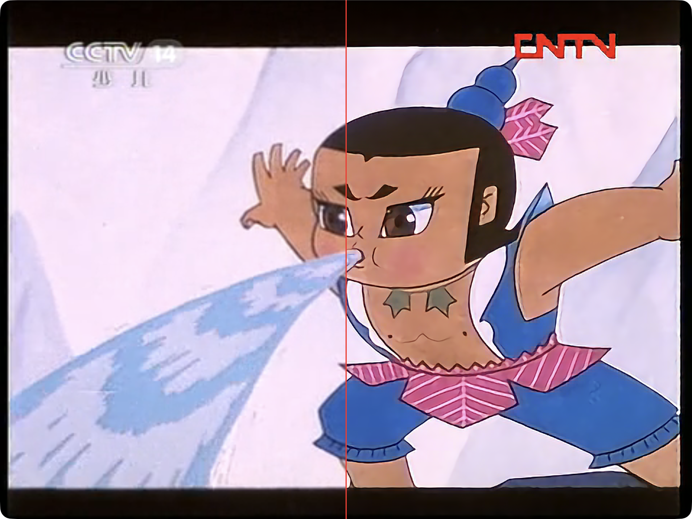

# Anime4KMetal

[English](./README.md) | [简体中文](./README-zh.md)

原生 Apple Metal Anime4K 图像增强库与命令行工具，提供 Swift Package 和 CLI。

该包刻意独立于 CinePlayer。库 API 处理 `CVPixelBuffer` 和 `CGImage`；播放器回调适配层应放在消费它的应用中。

包内置 Anime4K GLSL shader 资源，并通过 SwiftPM build plugin 编译 Metal host kernels，因此调用方不需要单独管理 shader 文件。

## 演示

<p align="center">
  
</p>

上方对比图来自 [CinePlayer](https://github.com/cinemore/CinePlayer)。CinePlayer 使用 Anime4KMetal 实现 Anime4K 风格的动漫超分和 A/B 对比。

## 要求

- macOS 13+ / iOS 16+
- Xcode 15.3+ / Swift 5.10+
- 支持 Metal 的 Apple 平台

## 安装

### Homebrew CLI

```bash
brew install cinemore/tap/anime4k-metal
```

Homebrew 包会安装与你 Mac CPU 架构匹配的原生命令行工具，并附带 Anime4K shader resource bundle：

```bash
anime4k-metal --input input.png --output output.png --preset modeAFast
```

### GitHub Release CLI

从 [latest release](https://github.com/cinemore/anime4k-metal/releases/latest) 下载适合你 Mac 的包：

- `anime4k-metal-macos-arm64.tar.gz`：Apple Silicon Mac
- `anime4k-metal-macos-x86_64.tar.gz`：Intel Mac
- `anime4k-metal-macos-universal.tar.gz`：需要同时覆盖两种架构时使用

```bash
tar -xzf anime4k-metal-macos-arm64.tar.gz
./anime4k-metal-macos-arm64/bin/anime4k-metal \
  --input input.png \
  --output output.png \
  --preset modeAFast
```

### Swift Package Manager Library

```swift
dependencies: [
    .package(url: "https://github.com/cinemore/anime4k-metal.git", exact: "0.1.4"),
],
targets: [
    .target(
        name: "YourTarget",
        dependencies: [
            .product(name: "Anime4KMetal", package: "anime4k-metal"),
        ]
    ),
]
```

在 Xcode 中可通过 **File -> Add Package Dependencies...** 添加仓库 URL。

## 库用法

```swift
import Anime4KMetal

let interpolator = try Anime4KInterpolator(
    configuration: .init(preset: .modeAFast)
)

let output = try interpolator.enhance(
    pixelBuffer: input,
    maxOutputWidth: 2560,
    maxOutputHeight: 1440
)
```

视频管线可使用 `CVPixelBuffer` 重载。图像工具和测试可使用 `CGImage` 重载。

## 预设

`Anime4KPreset` 暴露当前内置的 Anime4K mode presets：

- `.modeAFast`, `.modeBFast`, `.modeCFast`
- `.modeAAFast`, `.modeBBFast`, `.modeCAFast`
- `.modeAHQ`, `.modeBHQ`, `.modeCHQ`
- `.modeAAHQ`, `.modeBBHQ`, `.modeCAHQ`

消费方应用如果需要默认 UI 列表，可以使用 `Anime4KPreset.availablePresets`。

## 从源码运行 CLI

```bash
swift build -c release
./.build/release/anime4k-metal \
  --input input.png \
  --output output.png \
  --preset modeAFast \
  --max-width 2560 \
  --max-height 1440
```

传入 `--bench N` 可以重复运行同一增强流程并输出基础耗时统计。

## 验证

```bash
swift test
swift build -c release

swift run anime4k-metal \
  --input Tests/fixtures/input.png \
  --output /tmp/anime4k-output.png \
  --preset modeAFast \
  --max-width 128 \
  --max-height 96 \
  --bench 3
```

## 状态与路线图

当前已发布：Anime4K v3/v4 GLSL shader 资源、Metal host runtime、`CVPixelBuffer` 和 `CGImage` API，以及 macOS CLI。macOS 是主要运行目标。iOS 16+ 目标可以编译，但尚未在 iOS 设备上完成运行验证。

暂缓事项：HDR 感知处理、调用方提供输出 buffer pool、更多设备验证。

## 相关项目

- [bloc97/Anime4K](https://github.com/bloc97/Anime4K)：上游 Anime4K shader 项目，也是内置 GLSL shader 程序来源
- [imxieyi/Anime4KMetal](https://github.com/imxieyi/Anime4KMetal)：启发本包原生 Metal 方向的 Metal 实现

## 许可证

MIT License，见 [LICENSE](./LICENSE)。

内置 Anime4K shader 资源派生自 Anime4K（MIT），上游归属见 [THIRD-PARTY.md](./THIRD-PARTY.md)。
