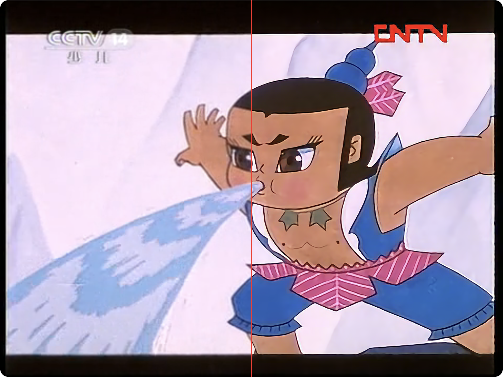

# Anime4KMetal

Native Apple Metal Anime4K image enhancement - Swift Package + CLI.

This package is intentionally independent from CinePlayer. Library APIs operate on
`CVPixelBuffer` and `CGImage`; player callback adapters belong in consuming apps.

The package ships Anime4K GLSL shader resources inline and compiles the Metal
host kernels through a SwiftPM build plugin, so consumers do not need separate
shader file management.

## Demo

<p align="center">
  
</p>

The comparison above is captured from
[CinePlayer](https://github.com/cinemore/CinePlayer), which uses Anime4KMetal
for Anime4K-style anime super-resolution and A/B comparison.

## Requirements

- macOS 13+ / iOS 16+
- Xcode 15.3+ / Swift 5.10+
- Metal-capable Apple platform

## Installation

### Homebrew CLI

```bash
brew install cinemore/anime4k-metal/anime4k-metal
```

The Homebrew package installs the native binary for your Mac's CPU architecture
plus the bundled Anime4K shader resource bundle:

```bash
anime4k-metal --input input.png --output output.png --preset modeAFast
```

### GitHub Release CLI

Download the archive for your Mac from the
[latest release](https://github.com/cinemore/anime4k-metal/releases/latest):

- `anime4k-metal-macos-arm64.tar.gz` for Apple Silicon Macs.
- `anime4k-metal-macos-x86_64.tar.gz` for Intel Macs.
- `anime4k-metal-macos-universal.tar.gz` when one archive must cover both.

```bash
tar -xzf anime4k-metal-macos-arm64.tar.gz
./anime4k-metal-macos-arm64/bin/anime4k-metal \
  --input input.png \
  --output output.png \
  --preset modeAFast
```

### Swift Package Manager Library

```swift
dependencies: [
    .package(url: "https://github.com/cinemore/anime4k-metal.git", branch: "main"),
],
targets: [
    .target(
        name: "YourTarget",
        dependencies: [
            .product(name: "Anime4KMetal", package: "anime4k-metal"),
        ]
    ),
]
```

In Xcode: **File -> Add Package Dependencies...** and paste the repo URL.

## Library usage

```swift
import Anime4KMetal

let interpolator = try Anime4KInterpolator(
    configuration: .init(preset: .modeAFast)
)

let output = try interpolator.enhance(
    pixelBuffer: input,
    maxOutputWidth: 2560,
    maxOutputHeight: 1440
)
```

`CVPixelBuffer` overloads are available for video pipelines. `CGImage` overloads
are provided for image tools and tests.

## Presets

`Anime4KPreset` exposes the currently bundled Anime4K mode presets:

- `.modeAFast`, `.modeBFast`, `.modeCFast`
- `.modeAAFast`, `.modeBBFast`, `.modeCAFast`
- `.modeAHQ`, `.modeBHQ`, `.modeCHQ`
- `.modeAAHQ`, `.modeBBHQ`, `.modeCAHQ`

Use `Anime4KPreset.availablePresets` when a consuming app wants the default UI
list.

## CLI from source

```bash
swift build -c release
./.build/release/anime4k-metal \
  --input input.png \
  --output output.png \
  --preset modeAFast \
  --max-width 2560 \
  --max-height 1440
```

Pass `--bench N` to run the same enhancement repeatedly and print basic timing
statistics.

## Validation

```bash
swift test                       # resource, preset, and smoke tests
swift build -c release           # release CLI/library build

swift run anime4k-metal \
  --input Tests/fixtures/input.png \
  --output /tmp/anime4k-output.png \
  --preset modeAFast \
  --max-width 128 \
  --max-height 96 \
  --bench 3
```

## Status & roadmap

Currently shipping: Anime4K v3/v4 GLSL shader resources, a Metal host runtime,
`CVPixelBuffer` and `CGImage` APIs, and a macOS CLI. macOS is the primary
runtime target. iOS 16+ targets compile but have not been runtime-validated on
iOS devices.

Deferred: HDR-aware processing, caller-supplied output buffer pools, and broader
device validation.

## Related projects

- [bloc97/Anime4K](https://github.com/bloc97/Anime4K) — upstream Anime4K shader
  project; source of the GLSL shader programs bundled here.
- [imxieyi/Anime4KMetal](https://github.com/imxieyi/Anime4KMetal) — Metal
  implementation that informed this package's native Metal direction.

## License

MIT License - see [LICENSE](./LICENSE).

Bundled Anime4K shader resources are derived from Anime4K (MIT) — see
[THIRD-PARTY.md](./THIRD-PARTY.md) for upstream attribution.
